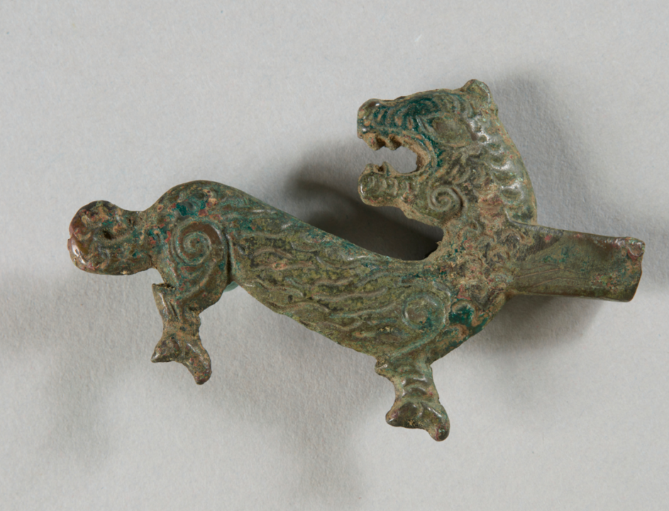
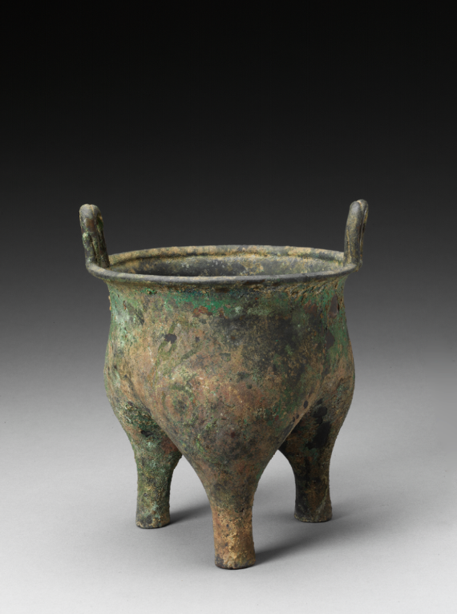
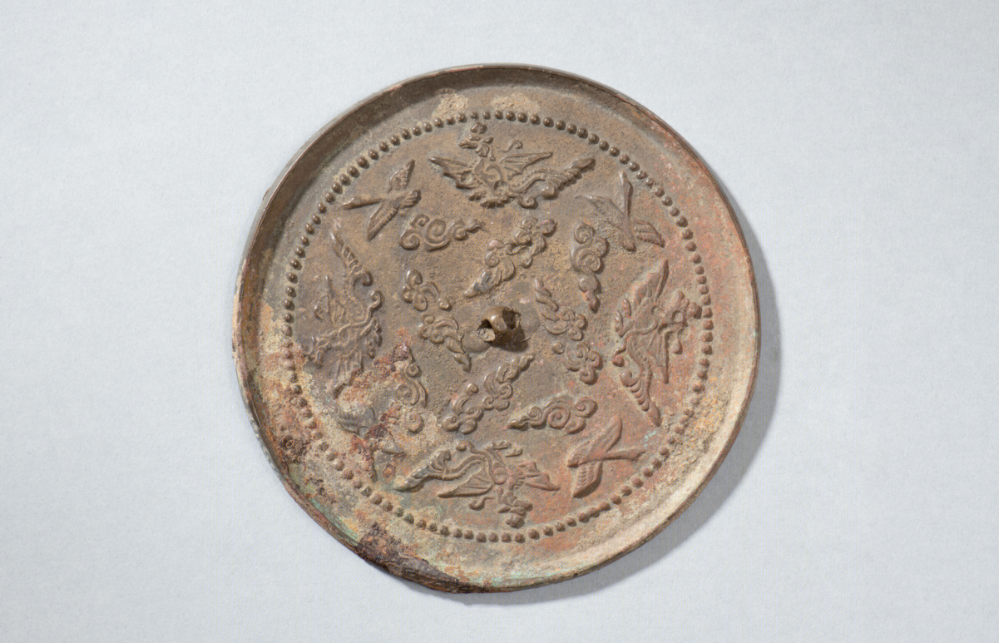
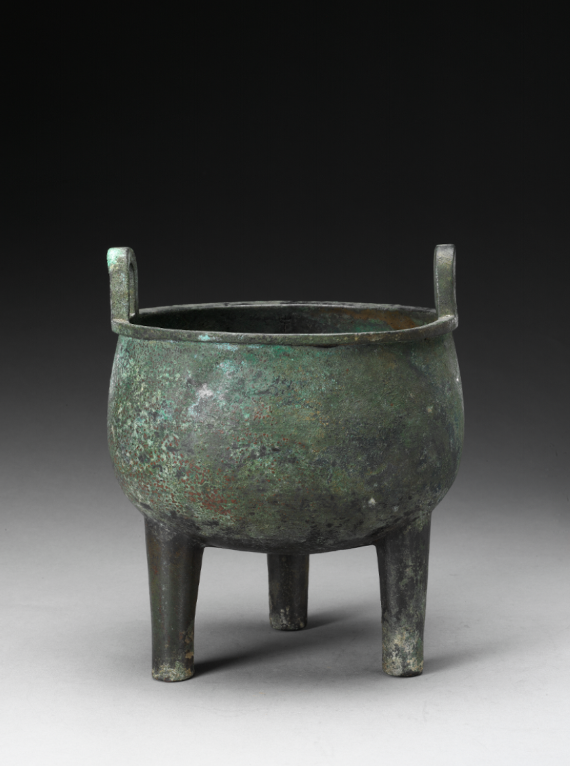
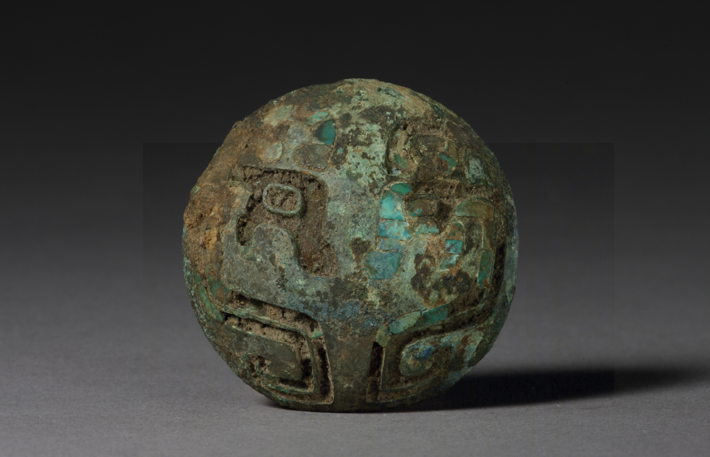
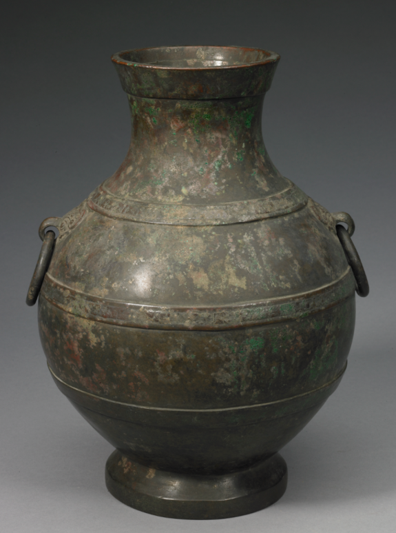

# BronzePBR

BronzePBR is a research dataset of high-quality 3D bronze artifact models paired with reference photographs. This repository currently provides six representative samples for preview and research demonstration. The complete dataset will be released in a future update.

## Dataset preview

Each sample folder contains a reference photograph (`preview.png`) and its matching textured 3D model (`model.glb`).

| Artifact | Reference photograph | 3D model |
| --- | --- | --- |
| 虎形带钩 (Tiger-shaped belt hook) |  | [GLB](samples/00023b19f67c40bba3fc0f018252e937_虎形带钩/model.glb) |
| 父乙鬲 (Fu Yi bronze li) |  | [GLB](samples/000cffb8074646d1ac54db0e595ccaca_父乙鬲/model.glb) |
| 云凤纹镜 (Cloud-and-phoenix mirror) |  | [GLB](samples/000f115d39ee4e4aa6c7fcfb71e6c2ba_云凤纹镜/model.glb) |
| 史庚父鼎 (Shi Geng Fu ding) |  | [GLB](samples/0021959ba15c49e09ebb4157fae25b76_史庚父鼎/model.glb) |
| 嵌松石马饰 (Turquoise-inlaid horse ornament) |  | [GLB](samples/0051174d7f754fef98fa3e7af9389449_嵌松石马饰/model.glb) |
| 兽耳衔环壶 (Ring-handled hu vessel) |  | [GLB](samples/00525d8c3667483f907c35a347581b8c_兽耳衔环壶/model.glb) |

## Repository structure

```text
BronzePBR/
├── README.md
└── samples/
    └── <artifact_id>_<artifact_name>/
        ├── preview.png
        └── model.glb
```

## File format

- Images: PNG reference photographs
- Models: binary glTF (`.glb`) with embedded geometry, materials, and textures
- Pairing: the artifact identifier in each folder uniquely associates the image with its 3D model

## Availability

This repository is an initial six-sample release. The complete BronzePBR dataset and detailed documentation will be made available in a future update.

## Contact

For questions about the dataset, please open an issue in this repository.
